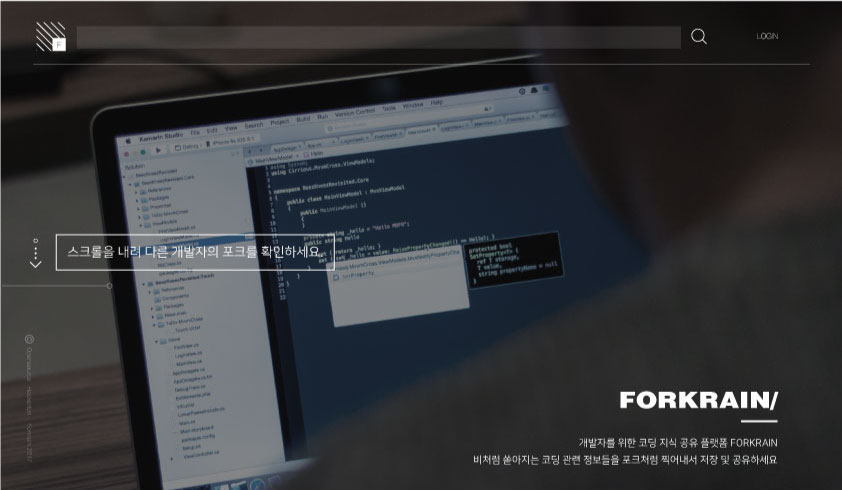

# ForkRain
#### 개발자들을 위한 코딩 지식 공유 및 개인화 플랫폼

- youtube : https://youtu.be/IAbN97KTDnE
- slideshare : https://www.slideshare.net/mobile/SungJunyoung/forkrain-ppt


---

## 소개
ForkRain은 여러 개발자들이 자신이 찾은 url을 저장 및 공유하고,
다른 개발자가 올린 url를 포크하며 자료를 수집하는 서비스 입니다.
url 을 게시하시면, 다음을 숙지하시고 pull-request 를 날려주세요!

## 사용법
#### url을 저장, 공유 하려면
: 블로그나 사이트에서 내가 저장해두고 보고싶거나 공유하고 싶은 자료를 찾았을 때
1. 공유할 url 가져옵니다.(링크 복사)
2. 공유할 url에 대한 해시태그(#) 설명과 함께 게시물을 Pull request 합니다.
3. merge가 되면 내 저장소와 검색을 통해 내가 가져온 url 게시물을 볼 수 있습니다.

#### url을 포크하려면
: 여러 url 게시물들을 보다가 포크하고 싶을 때 혹은 해시태그 검색을 통해 포크하고 싶은 게시물을 찾았을 때
1. Github id로 로그인을 합니다.
2. 게시물의 포크아이콘을 눌러 포크(fork)합니다.
3. 내 저장소에서 포크한 게시물을 볼 수 있습니다.

## 주의사항
: 게시글을 Pull request 할때 아래 양식에 따라 작성해주세요.

#### 번호 Git아이디 URL 해시태그1 ... 해시태그5


<예제>
```
4 changju https://imitator.kr/Linux/1329	서버 ssg접근 에러
3 seunjunyoung  http://egloos.zum.com/lucene/v/1386072 아파치 오픈소스  검색엔진
2 byulkim http://arduino.org/ 아두이노  IOT 센서  연결
1 doyeonlee https://www.edureka.co/blog/devops-tutorial 데브옵스 소프트웨어공학
```

> /forkrain-server/please-edit-me.txt 파일을 사용하여 url 게시가 가능합니다!  
> **해시태그는 5개까지 작성 가능합니다.**  
> 내림차순으로 정렬되 있으며 문서의 가장 위에 추가합니다.  
> 각각  index, githubid, url, [tags] 입니다.  
> 어뷰징은 즉시 reject 됩니다!

## ForkRain 을 사용해보세요!!
* 원하는 자료의 수집과 공유가 가능합니다.
* 당신도 오픈소스 contributor가 될 수 있습니다 :)
